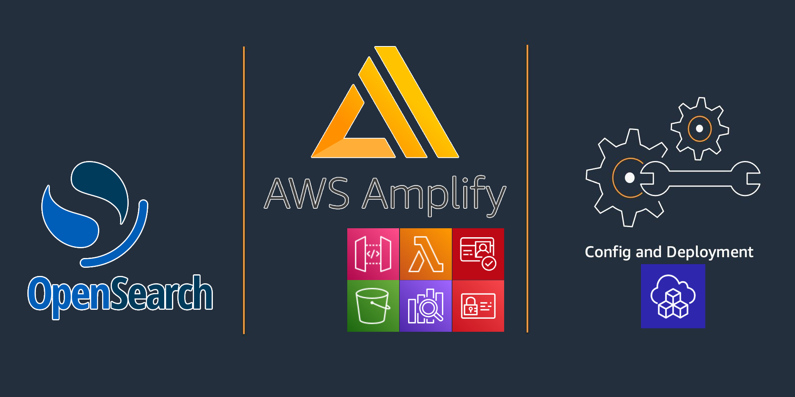
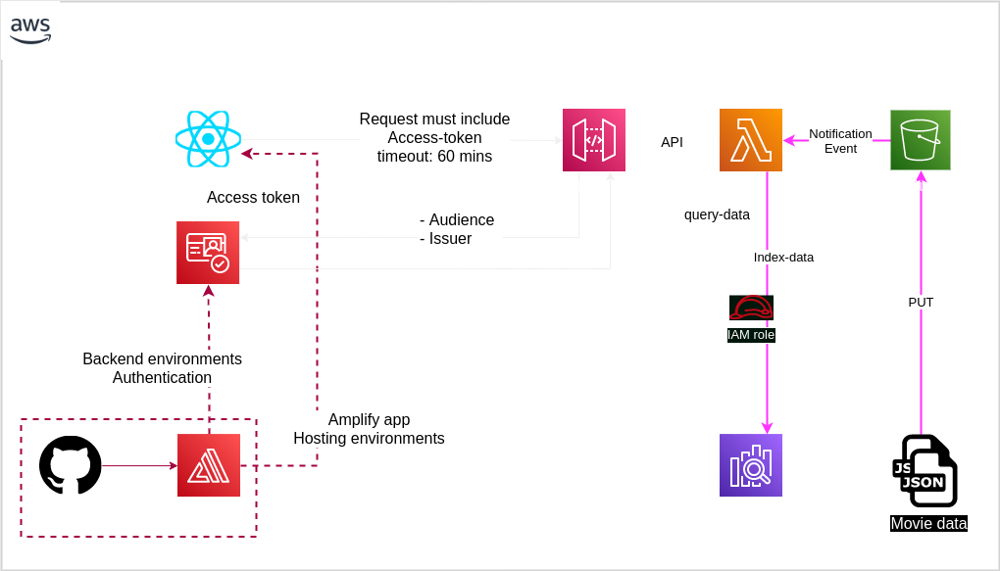
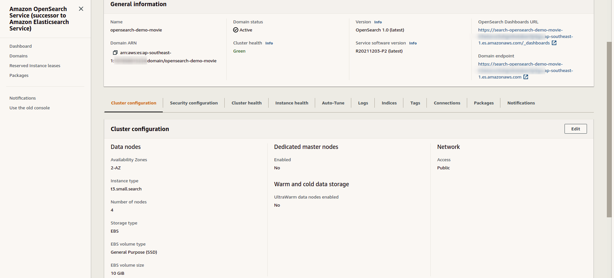
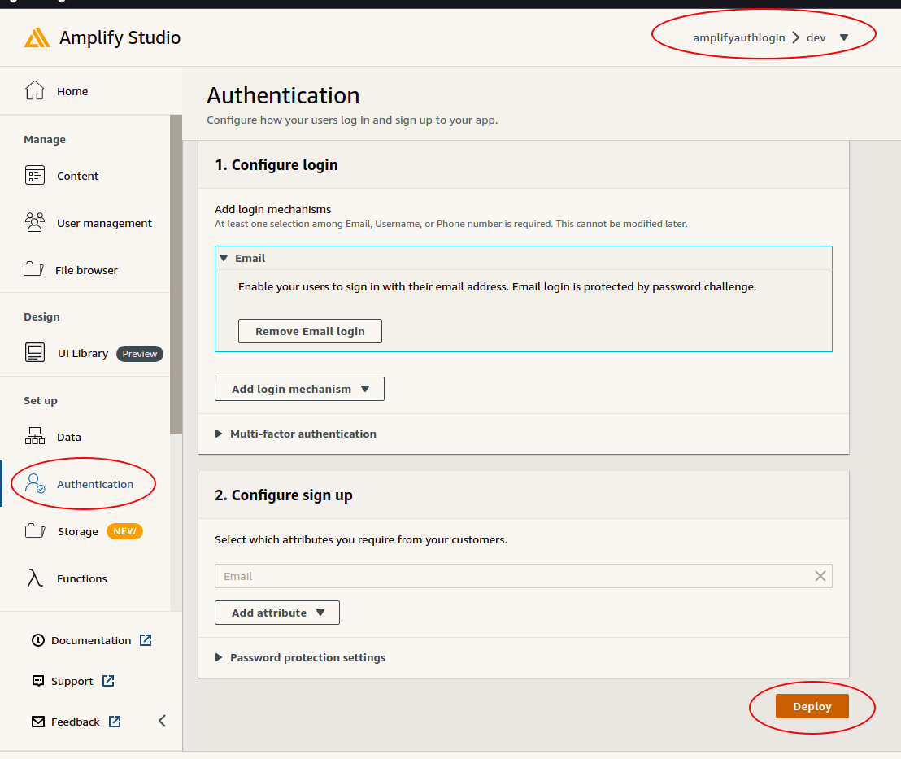
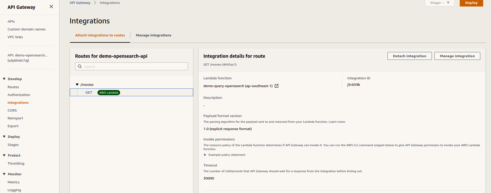
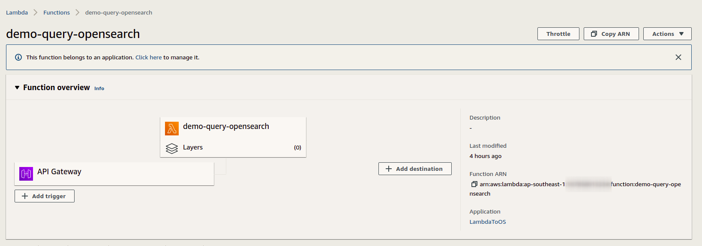
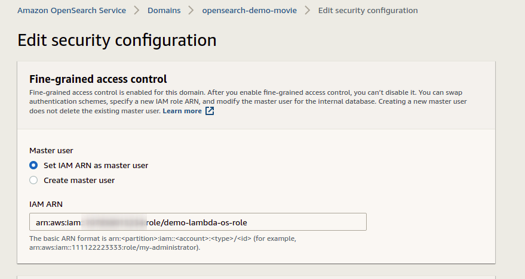
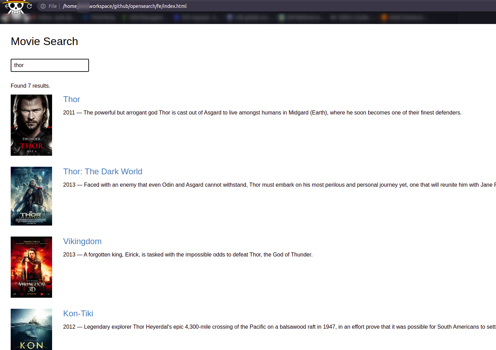
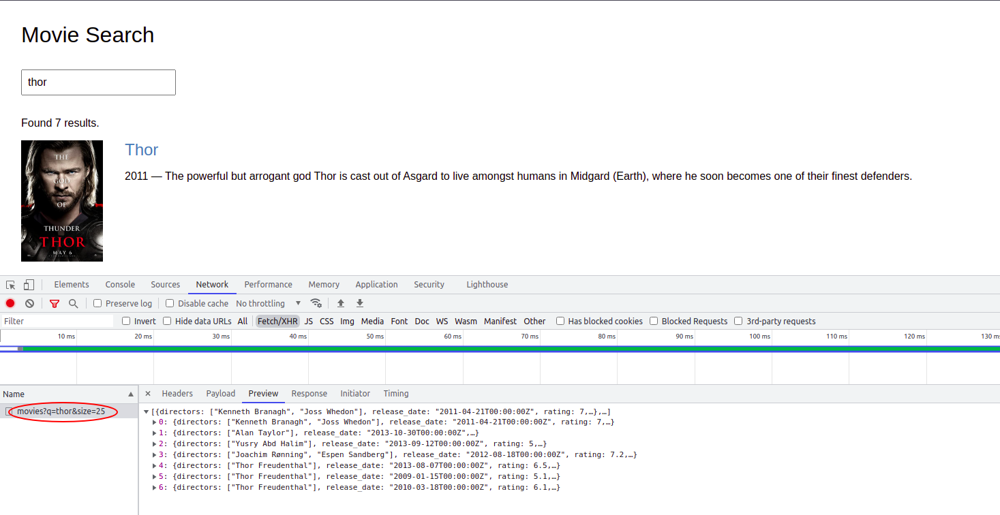

<p align="center">
  <a href="https://dev.to/vumdao">
    
  </a>
</p>
<h1 align="center">
  <div><b>Searching Best Movies With AWS Opensearch</b></div>
</h1>

## Abstract
- **[OpenSearch](https://github.com/opensearch-project/OpenSearch) is a community-driven, open source fork of Elasticsearch and Kibana following the licence change in early 2021.**
- This post goes overview of opensearch and make an demo of using opensearch with AWS Amplify for authenticate

## Table Of Contents
 * [OpenSearch Overview](#OpenSearch-Overview)
 * [Fine-grained access control](#Fine-grained-access-control)
 * [Opensearch API Documents](#Example-Queries-for-AWS-WAF-Logs)
 * [Opensearch Pricing](#Opensearch-Pricing)
 * [Partition Projection with Amazon Athena](#Partition-Projection-with-Amazon-Athena)
 * [Infra Overview](#Infra-Overview)
 * [Create Opensearch Domain](#Create-Opensearch-Domain)
 * [Create Cognito userpool using Amplify](#Create-Cognito-userpool-using-Amplify)
 * [Create lambda function to query opensearch domain](#Create-lambda-function-to-query-opensearch-domain)
 * [Create API Gateway using REST API with lamda integration](#Create-API-Gateway-using-REST-API-with-lamda-integration)
 * [Import data for indexing](#Import-data-for-indexing)
 * [Use React App To visualize the search result](#Use-React-App-To-visualize-the-search-result)

---

## 🚀 **OpenSearch Overview** <a name="OpenSearch-Overview"></a>
- **Master nodes** are responsible for actions such as creating or deleting indices, deciding which shards should be allocated on which nodes, and maintaining the cluster state of all nodes. The cluster state includes information about which shards are on which node, index mappings, which nodes are in the cluster and other settings necessary for the cluster to operate. Even though these actions are not resource intensive, it is essential for cluster stability to ensure that the master nodes remain available at all times to carry out these tasks.

- Although in small clusters it is possible to have master nodes which also carry out search and index operations (which is the default configuration), searching and indexing are both resource intensive, resulting in the node not having sufficient resources to carry out the master node tasks, ultimately resulting in cluster instability.

- For this reason, once a cluster reaches a certain size it is highly recommended to create 3 dedicated master nodes in different availability zones. The master nodes require excellent connectivity with the rest of the nodes in the cluster and should be in the same network.

- Use at least three nodes to avoid an unintentionally partitioned network (split brain). If the cluster has 2 only nodes, split-brain happens when there's communication network between them is interrupted. The both nodes think the other down and try to promote itself to become master. When the network communication fix, there're two masters and causes split-brain.

## 🚀 Fine-grained access control <a name="Fine-grained access control"></a>
- When enable Fine-grained access control in Amazon OpenSearch Service (not able to disable), following must be set
  - Node-to-node encryption
    - It provides an additional layer of security on top of the default features of Amazon OpenSearch Service.
    - Node-to-node encryption enables TLS 1.2 encryption for all communications within the VPC.
    - If you send data to OpenSearch Service over HTTPS, node-to-node encryption helps ensure that your data remains encrypted as OpenSearch distributes (and redistributes) it throughout the cluster. If data arrives unencrypted over HTTP, OpenSearch Service encrypts it after it reaches the cluster. You can require that all traffic to the domain arrive over HTTPS using the console, AWS CLI, or configuration API.

  - Encryption at rest - a security feature that helps prevent unauthorized access to your data. The feature encrypts the following aspects of a domain:
    - All indices (including those in UltraWarm storage)
    - OpenSearch logs
    - Swap files
    - All other data in the application directory
    - Automated snapshots

  - Enforce HTTPS

## 🚀 Opensearch API Documents <a name="Opensearch-API-Documents"></a>
- Put a single data to opensearch domain
```
curl -XPUT -u 'os-master-user:HOl0q3$L' 'https://search-opensearch-demo-movie-63wtzcvz3uhgmhotaban5jr6gu.ap-southeast-1.es.amazonaws.com/movies/_doc/1' -d '{"director": "Burton, Tim", "genre": ["Comedy","Sci-Fi"], "year": 1996, "actor": ["Jack Nicholson","Pierce Brosnan","Sarah Jessica Parker"], "title": "Mars Attacks!"}' -H 'Content-Type: application/json'
{"_index":"movies","_type":"_doc","_id":"1","_version":1,"result":"created","_shards":{"total":2,"successful":2,"failed":0},"_seq_no":0,"_primary_term":1}
```

- Push bulk data [`sample-movies.bulk`](https://docs.aws.amazon.com/opensearch-service/latest/developerguide/samples/sample-movies.zip)
```
curl -XPOST -u 'os-master-user:Q2rmr7hFn@am' 'https://search-opensearch-demo-movie-63wtzcvz3uhgmhotaban5jr6gu.ap-southeast-1.es.amazonaws.com/_bulk' --data-binary @sample-movies.bulk -H 'Content-Type: application/json'
```

- Search Document
```
curl -XGET -u 'os-master-user:Q2rmr7hFn@am' 'https://search-opensearch-demo-movie-63wtzcvz3uhgmhotaban5jr6gu.ap-southeast-1.es.amazonaws.com/movies/_search?q=mars&pretty=true'
{
  "took" : 485,
  "timed_out" : false,
  "_shards" : {
    "total" : 5,
    "successful" : 5,
    "skipped" : 0,
    "failed" : 0
  },
  "hits" : {
    "total" : {
      "value" : 1,
      "relation" : "eq"
    },
    "max_score" : 0.2876821,
    "hits" : [
      {
        "_index" : "movies",
        "_type" : "_doc",
        "_id" : "1",
        "_score" : 0.2876821,
        "_source" : {
          "director" : "Burton, Tim",
          "genre" : [
            "Comedy",
            "Sci-Fi"
          ],
          "year" : 1996,
          "actor" : [
            "Jack Nicholson",
            "Pierce Brosnan",
            "Sarah Jessica Parker"
          ],
          "title" : "Mars Attacks!"
        }
      }
    ]
  }
}
```

## 🚀 Opensearch Pricing <a name="Opensearch-Pricing"></a>
- Instance Usage
- Storage cost (EBS)
- Standard AWS data transfer charges
You need to pay standard AWS data transfer charges for the data transferred in and out of Amazon OpenSearch Service. You will not be charged for the data transfer between nodes within your Amazon OpenSearch Service domain.

## References:
- https://docs.aws.amazon.com/opensearch-service/latest/developerguide/search-example.html#search-example-lambda
- https://www.antstack.io/blog/getting-started-with-open-search/

---

# Creating infra services using Cloud development toolkit (CDK)

## 🚀 **Infra Overview** <a name="Infra-Overview"></a>




## 🚀 **Create Opensearch Domain** <a name="Create-Opensearch-Domain"></a>
- The domain includes
  - Cluster with 2 AZs and 4 nodes (no dedicated masters)
  - Enable Fine-grained access control
  - Version: OpenSearch 1.0
  - EBS: 10GB (SSD)
  - Access policy to allow `es:*` for user/iam role which is added to opensearch data security
  - Use secret manager to store `master-user`

<details>
<summary>opensearch-stack.ts</summary>

```
```

</details>



## 🚀 **Create Cognito userpool using Amplify** <a name="Create-Cognito-userpool-using-Amplify"></a>



## 🚀 **Create lambda function to query opensearch domain** <a name="Create-lambda-function-to-query-opensearch-domain"></a>
- Pre-create:
  - log group with retention 1 day
  - IAM role with log group permission
  - Lambda function handler `lambda-codes/app.js` uses nodejs 14 which query opensearch domain using `aws-sdk`. Package the source code
  ```
  cd lambda-codes
  npm i .
  zip -r app.zip *
  ```

- Lambda function stack

<details>
<summary>lambda-os.ts</summary>

```
```

</details>

## 🚀 **Create API Gateway using REST API with lamda integration** <a name="Create-API-Gateway-using-REST-API-with-lamda-integration"></a>
- API GW stack

<details>
<summary>api-rest.ts</summary>

```
```

</details>





## 🚀 **Import data for indexing** <a name="Import-data-for-indexing"></a>
- Retrieve password of `os-master-user` from secret manager for indexing data
```
curl -XPOST -u 'os-master-user:naster-password' 'https://search-opensearch-demo-movie-63wtzcvz3uhgmhotaban5jr6gu.ap-southeast-1.es.amazonaws.com/_bulk' --data-binary @sample-movies.bulk -H 'Content-Type: application/json'
```

## 🚀 Use React App To visualize the search result <a name="Use-React-App-To-visualize-the-search-result"></a>
- https://opensearch-demo.d6duyoamsniv4.amplifyapp.com/

- Add IAM role of lambda function to Fine-grained access control of opensearch domain
  

- Start `index.html` and then search





---

<h3 align="center">
  <a href="https://dev.to/vumdao">:stars: Blog</a>
  <span> · </span>
  <a href="https://github.com/vumdao/opensearch-demo">Github</a>
  <span> · </span>
  <a href="https://stackoverflow.com/users/11430272/vumdao">stackoverflow</a>
  <span> · </span>
  <a href="https://www.linkedin.com/in/vu-dao-9280ab43/">Linkedin</a>
  <span> · </span>
  <a href="https://www.linkedin.com/groups/12488649/">Group</a>
  <span> · </span>
  <a href="https://www.facebook.com/acquisition-104917804863956">Page</a>
  <span> · </span>
  <a href="https://twitter.com/VuDao81124667">Twitter :stars:</a>
</h3>

---